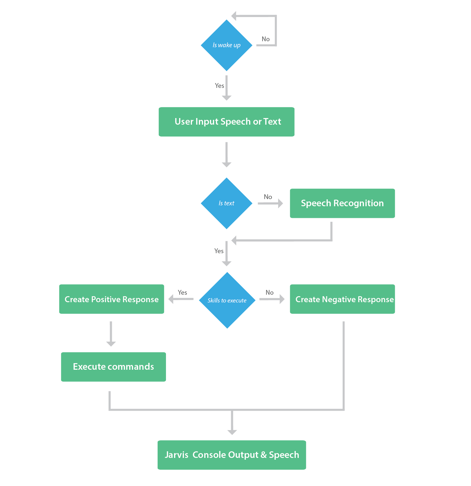

# Requirements

## Motivation
Have you ever wondered how cool it would be to have your own A.I. assistant? Imagine how easier it would be to send emails without typing a single word, doing Wikipedia searches without opening web browsers, and performing many other daily tasks like playing music with the help of a single voice command. In this Project, I had created my own personal A.I. assistant using Python. 

## Introduction
Artificial intelligence (AI) is a wide-ranging branch of computer science concerned with building smart machines capable of performing tasks that typically require human intelligence. AI is an interdisciplinary science with multiple approaches, but advancements in machine learning and deep learning are creating a paradigm shift in virtually every sector of the tech industry. An AI personal assistant is a piece of software that understands verbal or written commands and completes task assigned by the client. It is an example of weak AI that is it can only execute and perform quest designed by the user. 
Our voice assistant will able to do the followings things-
* It can send emails on your behalf.
* It can play music for you.
* It can do Wikipedia searches for you.
* It is capable of opening websites like Google, Youtube, etc., in a web browser.
* It is capable of opening your code editor or IDE with a single voice command.

## Cost and Features

### Cost
It is a prototype version and it uses open source software so it will be free of cost until the stable version is not made.

### Features
The various features of the AI Voice Assistant are :

1.Wish me\
2.Take Command\
3.Search Websites\
4.Play Music\
5.Open Application\
6.time\
7.Send Email

## Defining the System

